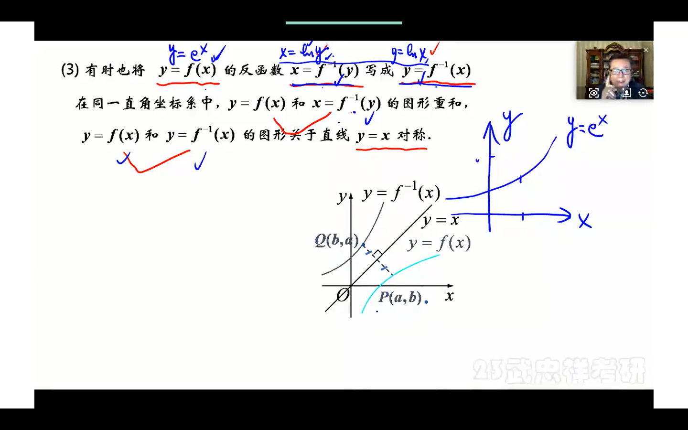

# 一、函数、极限**、连续
## 1.1微积分的主要研究对象
1. 函数y = f(x) (a<x<b)的变化规律
    1. 微观（变化率）==》导数
    2. 宏观（改变了）==》积分
2. 微积分研究思想
    1. 利用已知求未知
    2. 利用均匀变化研究非均匀变化
    3. 先局部均匀求近似再利用极限求精确 
3. 导数和积分的本质
    1. 导数是处理均匀量的商（除法）在处理非均匀量的发展
    2. 积分是处理均匀量的积（乘法）在处理非均匀量的发展   
## 1.2 函数的性质
1.  常考题型：
    1. 函数的性质
    2. 复合函数 
### 1.2.1 函数的概念以及常见函数
#### （1）函数
1. 函数：映射
2. 函数的两个基本要素f(D) = {y|y = f(x),x属于D}：
    1. 定义域
    2. 定义规则 
3. 常见函数：
    1. 符号函数 y = sgnx = {-1,0,1  
    2. 取整函数：y = [x]==>不超过X的最大整数;[3.8] = 3;[-3.8]=-4;x-1<[x]<=x
#### (2)复合函数 y = g[f(x)]
* 内层函数值域要与外层函数定义域相交非空（相交必须存在）
#### (3)反函数 x=f-1(y)是y=f(x)的反函数
1. x对y:多对一；或者1对1；（对于任意的y都有唯一的x与之对应）
2. 并不是所有的函数都有反函数例如：y=x^2
3. 单调函数是反函数（充分不必要条件）单调函数都有反函数，但不是所有反函数都单调（某些分段函数不单调）
4. 函数有反函数的充分必要条件：x与y是一一映射
5. 函数的反函数图形关于y=x对称（都以为自变量）

6. f-1[f(x)] = x(f-1[y] = x；反过来映射y)|||
f[f-1(x)] = x；反过来映射y)
7. 双曲正玄反函：y=shx = (e^x - e^-x)/2==反函数==>y= ln(x+根号下1+x^2)

#### (4)初等函数（5类基本初等函数和初等函数）

* 幂函数
* 指数函数
* 对数函数
* 三角函数
* 反三角函数
初等函数的定义：和常数和基本初等函数通过有限次的加、减、乘、除和复合所得到的且能用一个解析式表示的函数

### 1.2.2 函数的性质
* 常考题型：
    1. 函数单调性，有界性，奇偶性的判断
    2. 复合函数 
1. 单调性
2. 奇偶性
    1. 常见奇函数：sinx,tanx,arcsinx,arctanx,ln(1-x/1+x),ln(x+根号下1+x^2),e^x-1/e^x+1,f(x)-f(-x)
    2. 常见偶函数：cosx,x^2,|x|,f(x)+f(-x)
    3. 奇偶函数的特性
        1. 奇函数【f(-x)=-f(x)】：关于原点对称f(0)=0,在x=0有定义；奇+奇=奇；奇x奇=偶；奇+偶=奇；
        
        2. 偶函数：图像关于y轴对称；偶+偶=偶；偶x偶=偶；
        
3. 周期性（最小正周期T）f(x) = f(x+T)
    1. sinx,cosx 周期2pi;sin2x,|sinx|周期为pi
    2. 若f(x)以T为周期，则f(ax+b)的周期为T/|a|
4. 有界性 【M>0】
      1. 有界：【|f(x)|<=M】
          1. 常见有界函数：|sinx|<=1;|cosx|<=1;|arcsinx|<=pi/2;|arctanx|<pi/2;|arccosx|<=pi;
          2. 无穷小*有界 = 无穷小
      2. 无界：【|f(x)|>M】任意的x存在f(x)都大于M
## 1.3 极限
*  常考题型【选择，填空，证明，解答】：  
    1. 极限的概念性质及存在准则【选择】
    2. 求极限【计算|填空】
    3. 无穷小量阶的比较
     
### 1.3.1 极限的概念
* 存在任意的ε>0使得|x-a|<ε,那么x趋近与a;恒有a-ε<x<a+ε
1. 数列的极限
    1. 当N>n时候，恒有|x-a|<ε
    2. 收敛数列必有界
    3. 数列{Xn}的极限和前有限项无关：limXk=a==>limXk+1=a
    4. limXn=a <=互推=> limX2n-1(奇数列) = limX2n(偶数列) =a
    5. 反例（-1）^n
    6. limx=0<=等价=>lim|x|=0
2. 函数的极限【limf(x)=A】
* 任意的ε>0,存在着X>0,当|x|>X时（即趋向于正负无穷），|f(x)-A|<ε
1. limf(x)=A(x趋向于无穷)的充分必要条件是：x趋于正负无穷存在且相等例如：lim根号下x^2+1/x【x趋于无穷】极限不存在
2. limf(x)=A是limf(n)=A【数列也是特殊的函数即函数上的点】的充分不必要条件
3. 自变量趋于有限值的函数的极限【limf(x)=A（x趋于x0）】
    * 任意的ε>0【无穷小】,存在着&>0【无穷小】,当0<|x-x0|<&【x趋向于x0，但x!=x0】时（即x无限趋向于x0），|f(x)-A|<ε【f(x)可等于A】
    * 一个点在x0处的极限limf(x)【x趋于x0】与在x0点的函数值f(x0)无关
    * 例如：limsin(x*sin1/x)/x*sin1/x【x趋于0】极限不存在【当x=1/n*pi时分子等于0】
    * 左极限|右极限：左趋于x0|右趋于x0;
    在x0点处极限存在【limx=A（x趋于x0）】的充分必要条件是:左右极限存在且相等
    * 需要分左右极限求极限的问题：
    
        1. 分段函在分界点求极限【该分界点两侧函数表达式不同】
        2. ex【x趋于0|无穷型】
        3. arctanx【x趋于0|无穷】
        4. 经典例题：
### 1.3.2 极限的性质
1. 有界性：
    1. （数列）收敛数列必有界【收敛==》有界；数列收敛是有界的充分不必要条件；例如：(-1)^n】
    2. 若函数limf(x)存在【x趋于x0】，则f(x)在x0某去心领域有界【局部有界】；【limf(x)存在==》f(x)局部有界;充分不必要条件：例子：sin1/x（x趋于0；0点局部有界但无极限；始终在+1和-1之间震荡，无极限）】
2. 保号性：
    1. （数列）保号性：
        1. 极限值保数列项>0
        2. 数列项保函数值>=0
    2. （函数）保号性
        1. 极限值保函数值>0
        3. 函数值保极限值>=0
    
3. 极限和无穷小的关系
* limf(x)=A <==> f(x)+A+a(x)【无穷小】，其中lima(x)=0
### 1.3.3 极限存在准则
1. 夹逼准则【数列;多用于求n项和的极限】
2. 单调有界准则【数列】【与前n项无关】【多用于Xn+1=f(n)数列用递推关系定义的。（1）用单调有界准则证明极限存在（2）假设极限是a:a=f(a)==>a】
    * 单调有界数列必有极限
        * 单调增，有上界的数列必有极限
        * 单调减，有下界的数列必有极限
    
### 1.3.4 求极限技巧
1. lima^B【若a*B=k】=e^k
2. 使用排除法【选择题】：
    1. 出现一般函数时：构造出具体函数来排除
3. 【在有限项中**】和的极限 =  极限的和
4. sin1/x【x趋于0】的极限不存在；震荡
5. limf(x)*g(x)=limf(x)*limg(x);【前提：limf(x)与limg(x)存在】
6. limf(x)=f(x0)【x趋于0】【前提：f(x)在x0点连续】
### 1.3.5 无穷小量
1. 无穷小量的概念：极限为0的变量
2. 无穷小的比较【lima(x)=0;limb(x)=0】;
    1. 高阶无穷小:【分母比分子趋向0趋向的快】lima(x)/b(x)=0；【谁趋向于0的速度快谁更高阶***】
    2. 低阶：lima(x)/b(x)=无穷；【分母比分子趋向0趋向的慢】
    3. 同阶：lima(x)/b(x)=C【常数】!=0
    4. 等价：lima(x)/b(x)=1；记：a(x)~b
    (x)
    5. 无穷小的阶lima(x)/[b(x)]^k=C!=0;称：a(x)是b(x)的k阶无穷小
    6.例题
3. 无穷小量的性质
    1. 有限个无穷小的和仍然是无穷小
    2. 有限个无穷小的乘积仍然是无穷小
    3. 无穷小量和有界量的乘积是无穷小;例如：limx*1/sinx=0
### 1.3.6 无穷大量
* 1/x;1/1-cosx;1/x^2【x趋于0】
1. 常用的无穷大量的比较
    1. lnax<<x^b<<c^x【a>0,b>0c>1】例如：limlnx/x=0(x趋于正无穷)
    2.lnax<<x^b<<c^x<<n!<<n^n【a>0,b>0c>1】(x趋于无穷)
2. 无穷大量的性质：
    * 无穷大指的是正无穷和负无穷；无穷大+无穷大不一定等于无穷大
    * 正无穷+正无穷=正无穷【有限个】
    * 负无穷+负无穷=负无穷【有限个】
    * 无穷大*有界不一定等于无穷大【有界可以为0】
    1. 两个无穷大量的乘积是无穷大量
    2. 无穷大+有界等于无穷大
3. 无穷大量和无界变量的关***系：
    * 无穷大量==》无界变量
    * 例题
4. 无穷大量和无穷小的关系【注意：0也是无穷小】
    * 1/0是无意义的表达式
    * 当无穷小不等于0时，互为倒数
### 1.3.7 极限例题：
1. 
2. 
3. 
### 1.3.8求极限的8种方法
* 求极限非0常数可先算出
* 
1. 利用基本极限求极限：
    1. 常用基本极限：
    2. 1的无穷次方【凑e】
2. 利用等价无穷小代换求极限
    1. 
# 二、导数和微分
# 三、微分中值定理及其原理
# 四、不定积分
# 五、定积分和反常积分
# 六、定积分的应用
# 七、微分方程
# 八、多元微分及其应用
# 九、二重积分
# 十、无穷级数
# 十一、空间几何及其应用
# 十二、三重积分及线面积分  
